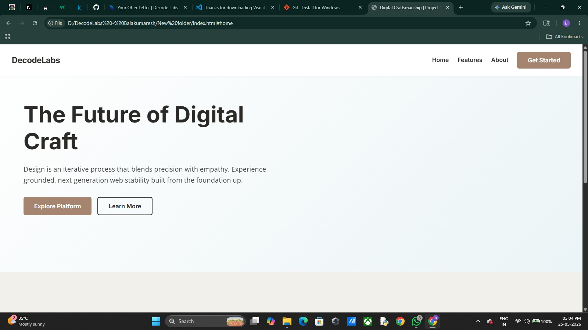
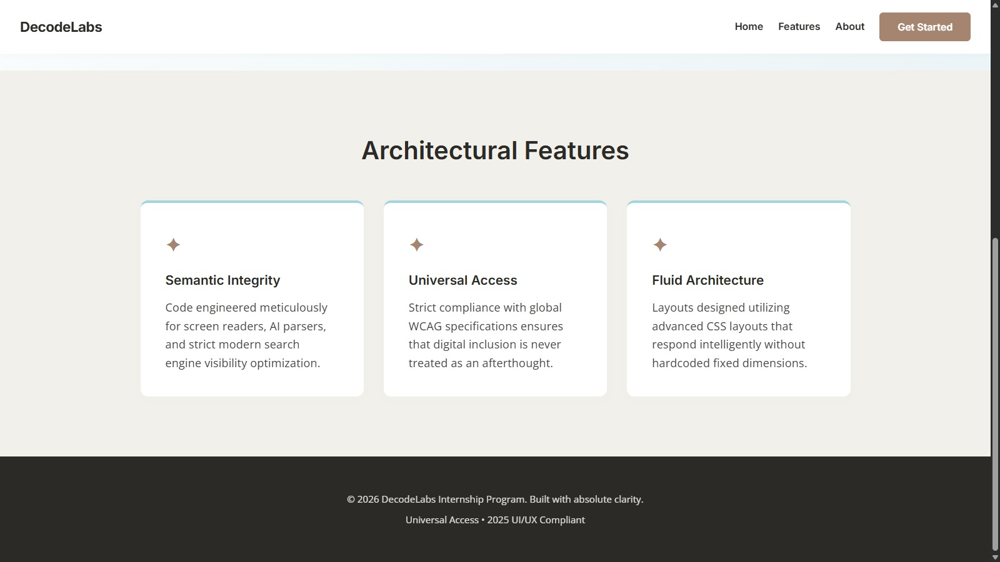

# Project-1---Decode-Labs---Internship:
# DecodeLabs Internship - Project 1: The Responsive Layout

This repository contains the completed *Project 1: Responsive Frontend Interface* milestone for the DecodeLabs Full Stack Development training track. It features a warm, grounded 2025 aesthetic layout optimized natively across mobile, tablet, and desktop views.

## File Architecture & Formats
The project is built entirely on native web standards without external framework dependencies:
1. *index.html* (HTML5 Document)
   - Core structural foundation of the application layout.
   - Built entirely with semantic landmark tags (<header>, <nav>, <main>, <article>, <footer>) to enforce strict universal access, accessibility (WCAG), and search engine optimization.

2. *style.css* (CSS3 Stylesheet)
   - Handles the overall presentation layer using a *Mobile-First Paradigm*.
   - *Macro Layout System:* Implements a strict 2D layout grid via CSS Grid, collapsing into 1 column on mobile devices, scaling to 2 columns on tablets (768px), and flattening into a 3-column architecture layout on desktop monitors (1024px).
   - *Micro Components:* Handled cleanly via Flexbox alignment properties (e.g., navigation item arrangements).
   - *Visual Tokens:* Employs the mandatory 2025 color palette: Mocha Mousse (#A5856F), Ethereal Blue (#A0D4E0), and Moonlit Grey (#F2F0EA). 
   - *Typography Constraints:* Bound to two geometric and highly legible font families (Inter and Open Sans) spanning a maximum of 3 font weights. Text scales dynamically utilizing fluid clamp() sizing formulas.

3. *script.js* (Vanilla JavaScript Source)
   - Lightweight interface behavior script executing zero compilation bugs.
   - Dynamically toggles mobile navigation drawer layout state (.active) on hamburger trigger interactions.
   - Updates dynamic aria-expanded properties concurrently to fulfill screen reader accessibility guidelines.

## How to Run Locally
1. Clone or download this repository folder to your machine.
2. Open the folder and double-click the index.html file to instantly run the application layout live inside any web browser.
3. Resize your desktop browser window or toggle mobile inspect view options (F12) to verify fluid adaptive layout changes across varying screen boundaries.

# DecodeLabs Internship - Project 1: The Responsive Layout

This repository contains the completed *Project 1: Responsive Frontend Interface* milestone for the DecodeLabs Full Stack Development training track. It features a warm, grounded 2025 aesthetic layout optimized natively across mobile, tablet, and desktop views.

## File Architecture & Formats

The project is built entirely on native web standards without external framework dependencies:

1. *index.html* (HTML5 Document)
   - Core structural foundation of the application layout.
   - Built entirely with semantic landmark tags (<header>, <nav>, <main>, <article>, <footer>) to enforce strict universal access, accessibility (WCAG), and search engine optimization.

2. *style.css* (CSS3 Stylesheet)
   - Handles the overall presentation layer using a *Mobile-First Paradigm*.
   - *Macro Layout System:* Implements a strict 2D layout grid via CSS Grid, collapsing into 1 column on mobile devices, scaling to 2 columns on tablets (768px), and flattening into a 3-column architecture layout on desktop monitors (1024px).
   - *Micro Components:* Handled cleanly via Flexbox alignment properties (e.g., navigation item arrangements).
   - *Visual Tokens:* Employs the mandatory 2025 color palette: Mocha Mousse (#A5856F), Ethereal Blue (#A0D4E0), and Moonlit Grey (#F2F0EA). 
   - *Typography Constraints:* Bound to two geometric and highly legible font families (Inter and Open Sans) spanning a maximum of 3 font weights. Text scales dynamically utilizing fluid clamp() sizing formulas.

3. *script.js* (Vanilla JavaScript Source)
   - Lightweight interface behavior script executing zero compilation bugs.
   - Dynamically toggles mobile navigation drawer layout state (.active) on hamburger trigger interactions.
   - Updates dynamic aria-expanded properties concurrently to fulfill screen reader accessibility guidelines.

## How to Run Locally
1. Clone or download this repository folder to your machine.
2. Open the folder and double-click the index.html file to instantly run the application layout live inside any web browser.
3. Resize your desktop browser window or toggle mobile inspect view options (F12) to verify fluid adaptive layout changes across varying screen boundaries.
